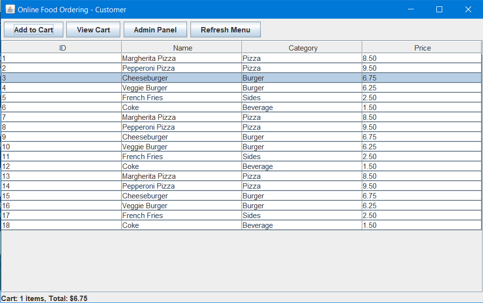
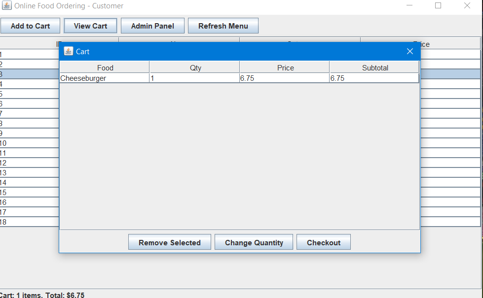

# 🍔 Online Food Ordering System

[](https://www.oracle.com/java/)
[](https://www.mysql.com/)
[](LICENSE)

---

## **Project Overview**

A **Java Swing-based online food ordering system** with a MySQL backend.  
Features include:

- Customer GUI to browse menu, add items to cart, and place orders.  
- Admin GUI to manage food items and view orders.  
- Optional client-server extension using sockets.

---

## **Project Structure**

```
src/
 ├─ app/
 │   └─ AppLauncher.java
 ├─ model/
 │   ├─ FoodItem.java
 │   ├─ CartItem.java
 │   └─ Order.java
 ├─ dao/
 │   ├─ Database.java
 │   ├─ FoodDAO.java
 │   └─ OrderDAO.java
 ├─ view/
 │   ├─ MenuUI.java
 │   ├─ CartUI.java
 │   └─ AdminUI.java
 ├─ client/   (optional socket client)
 └─ server/   (optional socket server)
lib/
 └─ mysql-connector-j-8.1.0.jar
bin/
 └─ compiled class files
```

---

## **Database Setup**

1. Create database and tables in MySQL:

```sql
CREATE DATABASE IF NOT EXISTS food_order CHARACTER SET utf8mb4 COLLATE utf8mb4_unicode_ci;
USE food_order;

CREATE TABLE IF NOT EXISTS food_item (
  id INT AUTO_INCREMENT PRIMARY KEY,
  name VARCHAR(100) NOT NULL,
  category VARCHAR(50),
  price DECIMAL(10,2) NOT NULL
);

CREATE TABLE IF NOT EXISTS orders (
  id INT AUTO_INCREMENT PRIMARY KEY,
  customer_name VARCHAR(100) NOT NULL,
  total DECIMAL(10,2) NOT NULL,
  created_at TIMESTAMP DEFAULT CURRENT_TIMESTAMP
);

CREATE TABLE IF NOT EXISTS order_item (
  id INT AUTO_INCREMENT PRIMARY KEY,
  order_id INT NOT NULL,
  food_id INT NOT NULL,
  quantity INT NOT NULL,
  price DECIMAL(10,2) NOT NULL,
  FOREIGN KEY (order_id) REFERENCES orders(id) ON DELETE CASCADE,
  FOREIGN KEY (food_id) REFERENCES food_item(id) ON DELETE RESTRICT
);
```

2. Optional: Insert sample data:

```sql
INSERT INTO food_item (name, category, price) VALUES
('Margherita Pizza', 'Pizza', 8.50),
('Pepperoni Pizza', 'Pizza', 9.50),
('Cheeseburger', 'Burger', 6.75),
('Veggie Burger', 'Burger', 6.25),
('French Fries', 'Sides', 2.50),
('Coke', 'Beverage', 1.50);
```

---

## **Setup & Run**

1. **Download MySQL Connector/J** and place `mysql-connector-j-8.1.0.jar` in `lib/`.  
2. Open terminal/PowerShell in `src/` folder.  
3. **Compile project:**

```powershell
mkdir bin
javac -cp ".;lib\mysql-connector-j-8.1.0.jar" -d bin app\*.java client\*.java server\*.java dao\*.java model\*.java view\*.java
```

4. **Run the application (Customer GUI):**

```powershell
java -cp "bin;lib\mysql-connector-j-8.1.0.jar" app.AppLauncher
```

5. (Optional) **Run server if using sockets:**

```powershell
java -cp "bin;lib\mysql-connector-j-8.1.0.jar" server.Server
```

---

## **Usage**

### Customer GUI (MenuUI)

- Browse menu items.  
- Add items to cart.  
- View cart and checkout (enter your name).  
- Click **Refresh Menu** to see updates made in Admin Panel.

### Admin GUI (AdminUI)

- Open via **Admin Panel** button.  
- Add, edit, or delete food items.  
- View all orders and order details.  

> ⚠️ Changes made in AdminUI require **Refresh Menu** in MenuUI to reflect.

---

## **Screenshots**

| Customer View | Cart View | Admin Panel |
|---------------|-----------|-------------|
|  |  |  |

> Replace the `screenshots/*.png` files with actual images from your project.

---

## **Notes**

- All model classes implement `Serializable` to work with Swing dialogs.  
- Update MySQL credentials in `dao/Database.java` before running.  
- Can be extended to client-server architecture using sockets.  

---

## **License**

MIT License. See [LICENSE](LICENSE) for details.